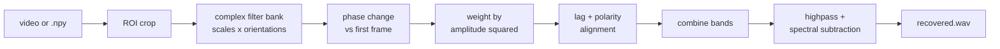
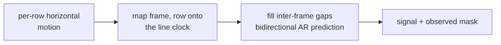

<div align="center">

# shiver

**Every object shivers when sound hits it. This reads the shiver.**

Recover audio from silent video by measuring sub-pixel vibrations as phase shifts.


[Demo](#the-demo) · [Scoreboard](#scoreboard) · [Quickstart](#quickstart) · [How it works](#how-it-works) · [Reproduce MIT](#reproduce-the-mit-rolling-shutter-check) · [Roadmap](#roadmap)

</div>

---

> [!WARNING]
> **Current vibe: the pixels are talking, but we do not speak fluent chip bag yet.** Synthetic sub-pixel recovery works, and the Raven benchmark produces a related signal. The MIDI note-sequence test still fails. This is an active experiment, not a magic silent-video-to-audio button. Bring curiosity, not courtroom evidence.

## The demo

The repo is building toward this:

| 1. Film | 2. Watch the silent clip | 3. Hear it |
| --- | --- | --- |
| A crinkled chip bag next to a speaker, camera locked to a tripod | The ROI barely appears to move | The sweep (and eventually speech) comes back from the pixels |

There is no demo GIF yet, on purpose. A real chip-bag clip goes here the day it works, and not before.

## Scoreboard

Every claim in this README maps to a row here. Raw numbers and commands live in [`docs/validation.md`](docs/validation.md).

| Test | Result | Status |
| --- | --- | --- |
| Synthetic 0.001 px sinusoid in noisy texture | abs correlation above 0.95 | ✅ pass |
| MIT Raven clip (public, 60 fps rolling shutter) | 0.626 waveform, 0.840 log-spectrum vs MIT's recovered audio, after lag/rate alignment | 🟡 provisional |
| Rolling-shutter MIDI note sequence | does not recover the notes | ❌ failing |
| Filmed tone sweep (our own footage) | not run yet | ⬜ todo |
| Speech | not run yet | ⬜ todo |

## Quickstart

Python 3.10+.

```bash
python -m venv .venv
. .venv/bin/activate
pip install -e '.[dev]'

vismic --synthetic --fps 1000 --frequency 73 --amplitude 0.001 -o out.wav
pytest
```

The terminal output should show a displacement `|correlation|` close to 1. Phase polarity is arbitrary, so the benchmark compares absolute correlation.

High-speed video (needs system FFmpeg or the optional `imageio` extra):

```bash
pip install -e '.[video]'
vismic in.mp4 --roi 120,80,256,256 --fps 2200 -o recovered.wav
```

Use the **capture** rate for `--fps`. Some high-speed cameras write misleading playback rates into the container.

Raw arrays work too, shaped `(time, height, width[, channels])`:

```bash
vismic frames.npy --fps 2200 -o recovered.wav
```

## Sample rate is physics

No software option changes this.

| Capture mode | Samples per second | What it means |
| --- | --- | --- |
| High-speed, global shutter | one per frame, so the capture fps | 240 fps cannot give intelligible speech. MIT's clips run 2,200 to 20,000 fps |
| Rolling shutter | one per sensor row, with holes between frames | Needs calibrated line timing. `vismic` will not guess it |

Rolling-shutter numbers for the Raven camera, from the paper: about 16 μs line delay, about 5 ms frame delay, 61,920 row samples/s effective, 1/2000 s exposure, roughly 2 kHz recoverable ceiling.

## How it works

Tiny surface motion changes the local phase of complex spatial filter responses. Measure the phase, get the motion, and the motion is the sound. Based on Davis et al., [*The Visual Microphone*](https://people.csail.mit.edu/mrub/VisualMic/) (SIGGRAPH 2014).



Flat and noisy regions get low weight, textured edges get high weight. That one step is most of why a chip bag works and a blank wall does not.

**Rolling-shutter mode** swaps the middle of the pipeline:



It follows the paper's coherent horizontal-motion model, so object and camera geometry still matter.

The filter bank is an original compact log-Gabor/analytic prototype, not a port of the authors' MATLAB complex steerable pyramid. That keeps the synthetic milestone easy to audit while keeping the phase behavior that matters. A Riesz-pyramid backend and GPU path come after real-video correctness is measured.

## Reproduce the MIT rolling-shutter check

MIT's data page has two rolling-shutter videos next to the much larger high-speed captures. The small one, Raven, is 32 MB, 1280x720 Motion JPEG at 59.94 fps. Assets download into the gitignored `data/mit/` directory. This repo never redistributes them.

```bash
python scripts/fetch_mit_data.py references
python scripts/fetch_mit_data.py raven

vismic data/mit/RollingShutter/KitKat-60Hz-RollingShutter-Raven-input.avi \
  --roi 100,0,1000,720 \
  --rolling-shutter --line-rate 61920 --fps 59.94 \
  --scales 2 --orientations 2 --highpass 40 --lowpass 2000 \
  -o artifacts/raven-vismic.wav

vismic-compare artifacts/raven-vismic.wav \
  data/mit/RollingShutter/KitKat-60Hz-RollingShutter-Raven-input.wav \
  --fmax 2000 --json
```

`vismic-compare` resamples, finds the best lag, tolerates arbitrary polarity and gain, and reports:

- absolute waveform correlation
- SI-SDR
- log-power-spectrum correlation
- time-varying log-spectrogram correlation

Compare against the source WAV and MIT's recovered WAV separately. They answer different questions.

The 2200 Hz chips/MIDI input is 10.8 GB, so the fetcher wants an explicit acknowledgement:

```bash
python scripts/fetch_mit_data.py chips-midi --allow-large
```

## Roadmap

**6 of 12 done.**

- [x] Deterministic sub-pixel synthetic generator
- [x] Phase recovery benchmark and tests
- [x] Streaming video/NumPy CLI, ROI crop, cleanup, WAV export
- [x] Per-row rolling-shutter phase extraction and explicit gap mask
- [x] Autoregressive inter-frame gap reconstruction
- [x] Provisional reproduction of the public MIT rolling-shutter Raven benchmark
- [ ] Pass the public rolling-shutter MIDI note-sequence gate
- [ ] Validate a filmed tone sweep and publish raw/recovered artifacts
- [ ] Calibrate line delay from camera metadata or a flicker target
- [ ] Recover speech
- [ ] Visual spectrogram and vibration-heatmap viewer
- [ ] Profile, then move the measured hot loop to CuPy/Rust/wgpu

## Help wanted

- **Filmed footage with measured line delay.** Phone model, fps, readout direction, raw file, and the speaker's source audio. This is the biggest gap.
- **Line-delay calibration** from metadata or a flicker target.
- **Riesz pyramid backend.**
- **Why the MIDI gate fails.** If you see it, open an issue.

<details>
<summary><b>Capture checklist for the tone-sweep gate</b></summary>

<br>

- Lock exposure, focus, white balance, and stabilization. Use a solid tripod.
- Fill the ROI with a textured, specular object such as a chip bag.
- Use bright continuous lighting and the shortest practical exposure.
- Record the emitted sweep separately as ground truth.
- Record the actual capture fps. For rolling shutter, also measure line delay and readout direction.
- Keep raw footage. Compression and rescaling can destroy the phase signal.

</details>

<details>
<summary><b>Repo layout</b></summary>

<br>

```text
src/vismic/
  pyramid.py          complex oriented filter bank
  recover.py          phase extraction, weighting, alignment
  synthetic.py        known fractional-pixel benchmark
  rolling_shutter.py  per-row extraction, line clock, AR gap filling
  metrics.py          lag/rate-tolerant reference comparison
  audio.py            cleanup and WAV export
  io.py / cli.py      inputs, ROI, command line
tests/                synthetic, timing, I/O tests
docs/validation.md    pass/fail benchmark record
```

</details>

## Scope, consent, provenance

This is an experimental measurement tool, not a promise that arbitrary silent footage contains recoverable audio. Only process recordings you are authorized to analyze, and follow local privacy and recording laws.

This repo is an independent implementation. It contains no MIT sample footage and no MATLAB code. The fetcher only pulls assets from their original host. The linked manuscript and third-party data have their own terms, and the authors' work is marked patent-pending by MIT.

Links: [project page and samples](https://people.csail.mit.edu/mrub/VisualMic/) · [official data and results](https://data.csail.mit.edu/vidmag/VisualMic/) · [open-access manuscript](https://dspace.mit.edu/handle/1721.1/100023)

## Citation

If this is useful in research, cite the original work:

```bibtex
@article{Davis2014VisualMic,
  author  = {Abe Davis and Michael Rubinstein and Neal Wadhwa and
             Gautham J. Mysore and Fr\'{e}do Durand and William T. Freeman},
  title   = {The Visual Microphone: Passive Recovery of Sound from Video},
  journal = {ACM Transactions on Graphics (Proc. SIGGRAPH)},
  volume  = {33},
  number  = {4},
  pages   = {79:1--79:10},
  year    = {2014}
}
```

## License

Code in this repository is MIT licensed.
